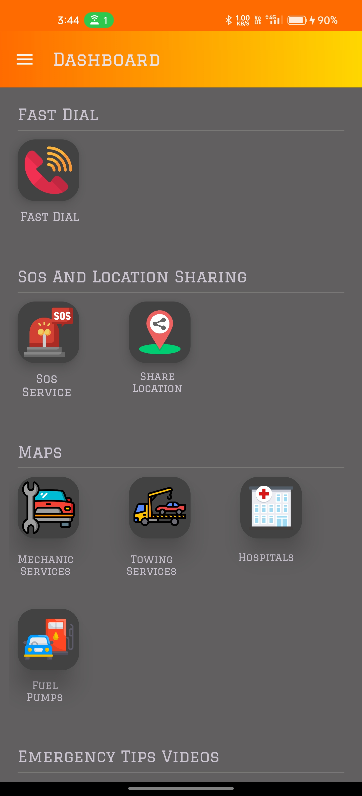
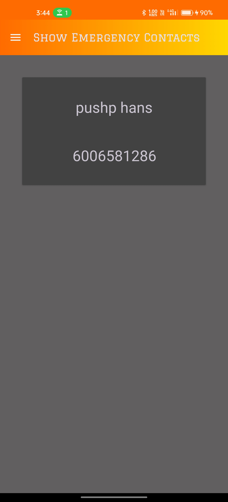
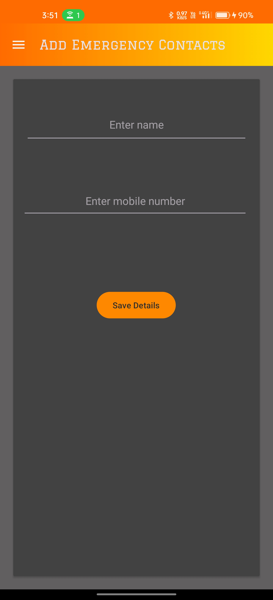
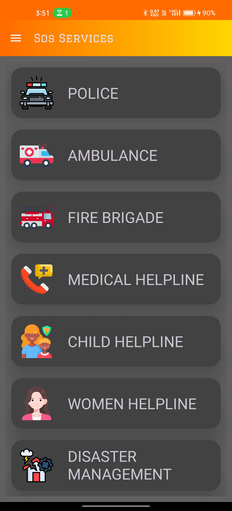
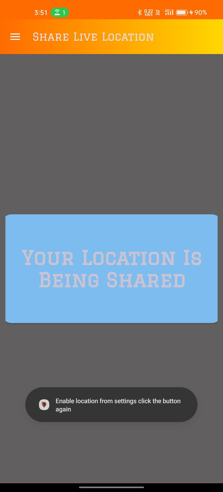
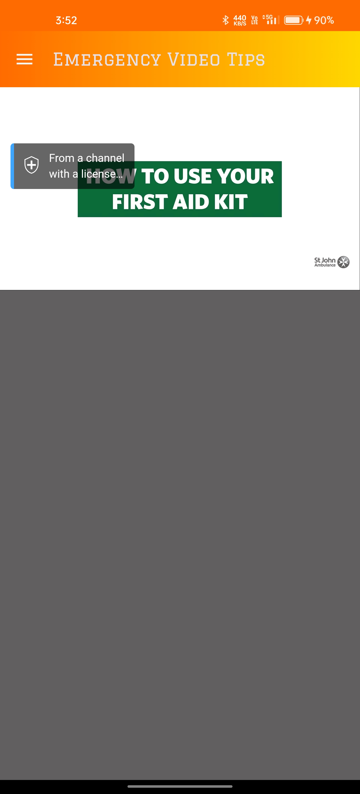

# 🚨 Emergency App

> All-in-one offline + online emergency assistance Android app with fast dial, SOS, Emergency location sharing, map support, and emergency tutorials.

<br>

## 🖼️ Screenshots

<!-- Replace the underscores with actual filenames like home.jpg, sos.jpg etc -->

### 🔸 Home Screen


<br>

### 🔸 Rapid Dial Contacts


<br>

### 🔸 Add Emergency Contact


<br>

### 🔸 SOS Screen


<br>

### 🔸 Share Location


<br>

### 🔸 Nearby Maps (Hospitals, Fuel Pumps, Mechanics)


<br>

### 🔸 Emergency Videos


<br>

## 🚀 Features

- 📍 **Share Live Location** via GPS
- 🆘 **One-tap SOS Calling**
- 📞 **Fast Dial for Emergency Contacts**
- ➕ **Add Emergency Contacts (stored locally)**
- 🗺️ **Maps Integration for:**
    - Hospitals Nearby
    - Fuel Pumps Nearby
    - Mechanics Nearby
- 🎥 **Watch Emergency Help Videos** (like First Aid, Puncture Repair)
- 🧠 **Clean UI**, fully offline persistence for saved contacts

<br>

## 🔧 Tech Stack

- **Language:** Kotlin
- **Architecture:** MVVM
- **Backend:** Room Database (for local contacts)
- **APIs / SDKs:**
    - Google Maps via WebView
    - YouTube Player API (for emergency videos)
    - Content Resolver (for contact integration)
- **Libraries Used:**
    - Glide (for images)
    - ViewBinding
    - Navigation Component

<br>

## 🛠️ Installation

1. Clone the repository
   ```bash
   git clone https://github.com/your-username/EmergencyApp.git

2. Open the project in Android Studio 
3. Run the app on device or emulator
> (Make sure location permission is enabled)

<br>

# 🤝 Contribution
> Pull requests are welcome. For major changes, open an issue first to discuss.

<br>

# 📬 Contact
> Have feedback or suggestions? 📩 Email me at: pushp.hans1502@gmail.com